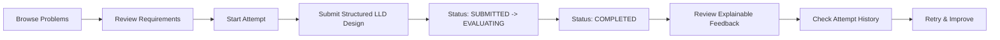
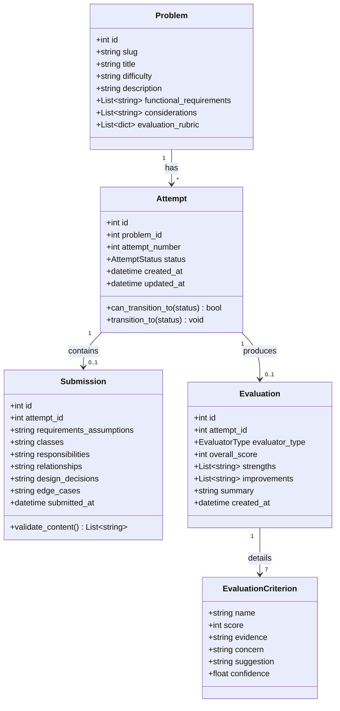
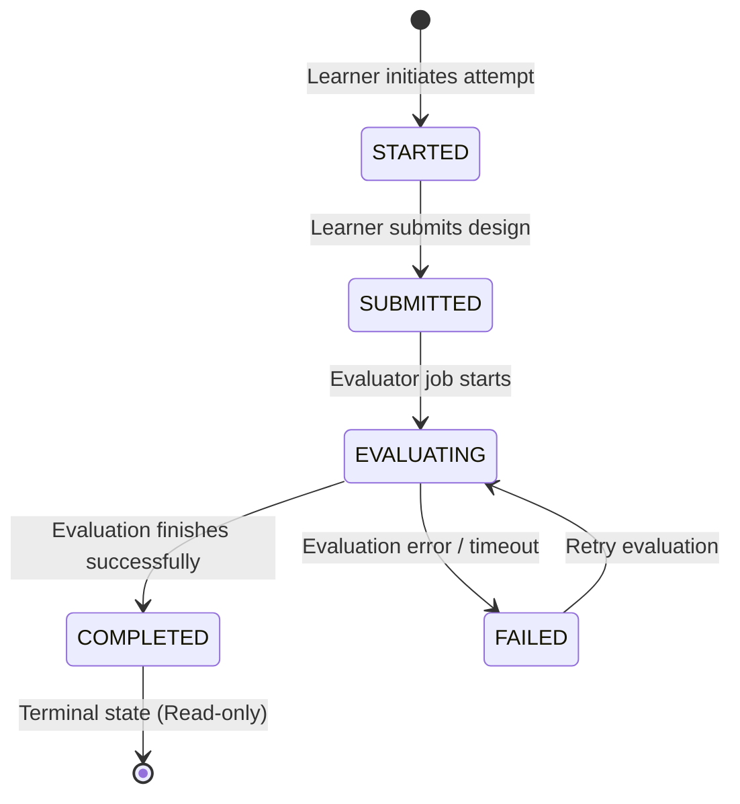

# Architecture & Design Note: LLD Practice Platform

## 1. Product Goal
The **LLD Practice Platform** is a focused, deliberate-practice system designed to help software engineers master Low-Level Design (LLD) and Object-Oriented Design (OOD). It enables learners to study real-world LLD problems, craft structured design solutions, receive explainable, rubric-based feedback, review attempt histories, and iterate on their designs to measure concrete improvement over time.

---

## 2. User Journey
The core practice loop follows a strict, repeatable learning sequence:



1. **Browse**: User views problems (`Parking Lot`, `Elevator System`, `Vending Machine`) with difficulty tags.
2. **Review**: User inspects functional requirements, scale considerations, and evaluation rubrics.
3. **Practice**: User creates a new attempt (e.g., Attempt #1) and enters their design across 6 structured areas.
4. **Submit**: Client-side and server-side validation verify minimum content; attempt moves from `SUBMITTED` &rarr; `EVALUATING` &rarr; `COMPLETED`.
5. **Feedback**: Learner reviews the overall score (0–100), evaluator badge (`AI` vs `RULE_BASED`), executive summary, strengths, improvements, and 7 detailed rubric criteria with evidence and actionable suggestions.
6. **History & Retry**: Learner inspects historical attempts and starts Attempt #2 to test improved designs.

---

## 3. MVP Scope
- **Problems**: Exactly 3 seed problems (Parking Lot, Elevator System, Vending Machine).
- **Format**: 6-section structured text submission (Requirements, Classes, Responsibilities, Relationships, Design Decisions, Edge Cases).
- **Evaluation Engine**: Dual-strategy architecture featuring an AI evaluator (`AIEvaluator`) and a 100% deterministic fallback evaluator (`RuleBasedEvaluator`).
- **Database**: Zero-configuration local SQLite persistence.
- **Explicit Non-Goals**: No authentication, microservices, Docker orchestration, message brokers (Kafka/RabbitMQ), payment gateways, or graphical UML canvas editors.

---

## 4. Architecture & Separation of Concerns
The backend follows a clean, layered monolithic architecture:

```
[ Frontend: React + TypeScript + Vite ]
                   │ HTTP / JSON REST
                   ▼
┌────────────────────────────────────────────────────────┐
│ FastAPI Web API Layer (routers: problems, attempts)    │
├────────────────────────────────────────────────────────┤
│ Service Orchestration Layer (AttemptService, Problem)  │
├──────────────────────────┬─────────────────────────────┤
│ Evaluator Strategy Layer │ Domain Models & Invariants  │
│ (BaseEvaluator, AI, Rule)│ (Attempt, Submission, State)│
├──────────────────────────┴─────────────────────────────┤
│ Repository Layer (AttemptRepository, ProblemRepository)│
├────────────────────────────────────────────────────────┤
│ Infrastructure: SQLite DB via SQLAlchemy ORM           │
└────────────────────────────────────────────────────────┘
```

- **Domain Layer (`app/domain/`)**: Pure business models and domain exceptions independent of web framework or database specifics.
- **Evaluator Layer (`app/evaluators/`)**: Implements the Strategy Pattern behind `BaseEvaluator`.
- **Service Layer (`app/services/`)**: Orchestrates attempt lifecycles, state machine transitions, and evaluation dispatch.
- **Repository Layer (`app/repositories/`)**: Encapsulates all database queries and transactions.
- **API Layer (`app/api/`)**: FastAPI routes with Pydantic request/response validation.

---

## 5. Domain Model & Invariants



### Domain Invariants:
1. An Attempt belongs to exactly one Problem.
2. Attempt numbers increment sequentially per problem (`1, 2, 3...`).
3. An Attempt cannot transition directly from `STARTED` to `COMPLETED`; it must pass through `SUBMITTED` &rarr; `EVALUATING`.
4. Resubmission is strictly prohibited on `COMPLETED` attempts; learners must start a new attempt to retry.
5. If evaluation encounters an unexpected runtime fault, attempt status moves to `FAILED`, but **the student submission is unconditionally preserved in the database**.

---

## 6. Evaluator Design & Strategy Pattern
Evaluation is decoupled behind the `BaseEvaluator` abstract interface:

```python
class BaseEvaluator(ABC):
    @abstractmethod
    async def evaluate(self, problem: ProblemModel, submission: SubmissionModel) -> EvaluationDomain:
        pass
```

### Strategy Implementations:
1. **`RuleBasedEvaluator`**:
   - Executes deterministic checks: section length thresholds, keyword matching for problem domain entities, OOP relationship terminology, and edge case keywords.
   - Calculates 0–10 scores for all 7 standard rubric criteria.
   - Generates grounded evidence, constructive concerns, and actionable suggestions.
   - Operates with 100% reliability with zero external dependencies.

2. **`AIEvaluator`**:
   - Calls an OpenAI-compatible LLM endpoint using structured prompting.
   - Enforces a rigorous JSON schema with the 7 criteria, evidence quotes, and confidence ratings.
   - Wraps external calls in exception handlers: if the model times out, returns HTTP errors, or outputs invalid JSON, it immediately invokes `RuleBasedEvaluator` and records `evaluator_type = AI_FALLBACK`.

---

## 7. Submission State Model



---

## 8. Database Model (SQLite)
Five relational tables:
- `problems`: `id`, `slug`, `title`, `difficulty`, `description`, `functional_requirements` (JSON), `considerations` (JSON), `evaluation_rubric` (JSON), `created_at`.
- `attempts`: `id`, `problem_id`, `attempt_number`, `status`, `created_at`, `updated_at`.
- `submissions`: `id`, `attempt_id`, `requirements_assumptions`, `classes`, `responsibilities`, `relationships`, `design_decisions`, `edge_cases`, `submitted_at`.
- `evaluations`: `id`, `attempt_id`, `evaluator_type`, `overall_score`, `strengths` (JSON), `improvements` (JSON), `summary`, `created_at`.
- `evaluation_criteria`: `id`, `evaluation_id`, `name`, `score`, `evidence`, `concern`, `suggestion`, `confidence`.

---

## 9. Failure Handling & Submission Preservation
- **Preservation First**: The submission is written to SQLite *before* evaluation is invoked. If an evaluator throws an unhandled exception or external network error, the attempt moves to `FAILED`. The learner's text is never lost.
- **Graceful Degradation**: If `AIEvaluator` fails, the system falls back to `RuleBasedEvaluator` transparently, tagging the result as `AI_FALLBACK`.
- **Clean Error Surfacing**: API catches domain exceptions (`ProblemNotFound`, `InvalidSubmission`, `InvalidStateTransition`) and returns clean HTTP status codes (404, 422, 400) without exposing internal stack traces or secrets.

---

## 10. Key Trade-offs

| Decision | Alternative Considered | Rationale for Choice |
| :--- | :--- | :--- |
| **Structured Text Form** | Freeform text or Canvas UML editor | Freeform text lacks consistency; UML editors incur high cognitive/UI overhead for a 2-day MVP. Structured text matches real interview cadence. |
| **Monolithic FastApi + SQLite** | Microservices + Postgres + Redis | Avoids premature distributed complexity. Monolith runs anywhere with zero setup. |
| **Direct Evaluator Call** | RabbitMQ / Celery background workers | The evaluation takes <1s (rule-based) or ~3s (LLM). An async service call in FastAPI is sufficient and avoids running a broker daemon. |
| **Strategy Pattern for Evaluators** | Hardcoded conditional branches in service | Isolates evaluation logic, simplifies testing with test doubles, and directly satisfies assignment extensibility requirements. |

---

## 11. Change Tests (Extensibility Proof)

### Change Test A: Supporting Class Diagrams in the Future
*Scenario*: Today learners submit structured text. Later the platform adds support for UML class diagrams (e.g. Mermaid syntax or visual canvas graph).

*How the architecture accommodates this without rewriting the practice flow*:
1. **Extending the Domain Model**: Define a polymorphic submission hierarchy or format enum:
   ```python
   class SubmissionFormat(str, Enum):
       STRUCTURED_TEXT = "STRUCTURED_TEXT"
       DIAGRAM_MERMAID = "DIAGRAM_MERMAID"
   ```
2. **Schema Extension**: The `Submission` entity adds an optional `diagram_payload: Optional[str]` or an abstract `BaseSubmissionContent` payload.
3. **Practice Flow Unchanged**: The `AttemptService.submit_and_evaluate()` method delegates validation to a format-specific validator (`DiagramSubmissionValidator`) and passes the submission entity to the evaluator. The state machine (`SUBMITTED` &rarr; `EVALUATING` &rarr; `COMPLETED`) remains completely identical.

### Change Test B: Adding Human Review or Static Analysis Later
*Scenario*: Today feedback comes from an AI evaluator or fallback rule evaluator. Later the platform adds human mentor review or AST code linters.

*How the evaluator abstraction accommodates this without rewriting the core practice flow*:
1. **New Strategy Implementation**: Implement `BaseEvaluator`:
   ```python
   class HumanReviewEvaluator(BaseEvaluator):
       async def evaluate(self, problem, submission) -> EvaluationDomain:
           # Places submission in mentor review queue; completes asynchronously
           ...
   ```
2. **Configuration & Factory**: `EvaluatorFactory` can select the strategy based on problem settings, user preferences, or runtime flags (`settings.EVALUATOR_MODE = "HUMAN"`).
3. **Zero API Changes**: The endpoints `POST /api/attempts/{id}/submit` and `GET /api/attempts/{id}/evaluation` consume the exact same contracts. The frontend continues displaying the 7 rubric criteria without needing to know which evaluator produced the feedback.
